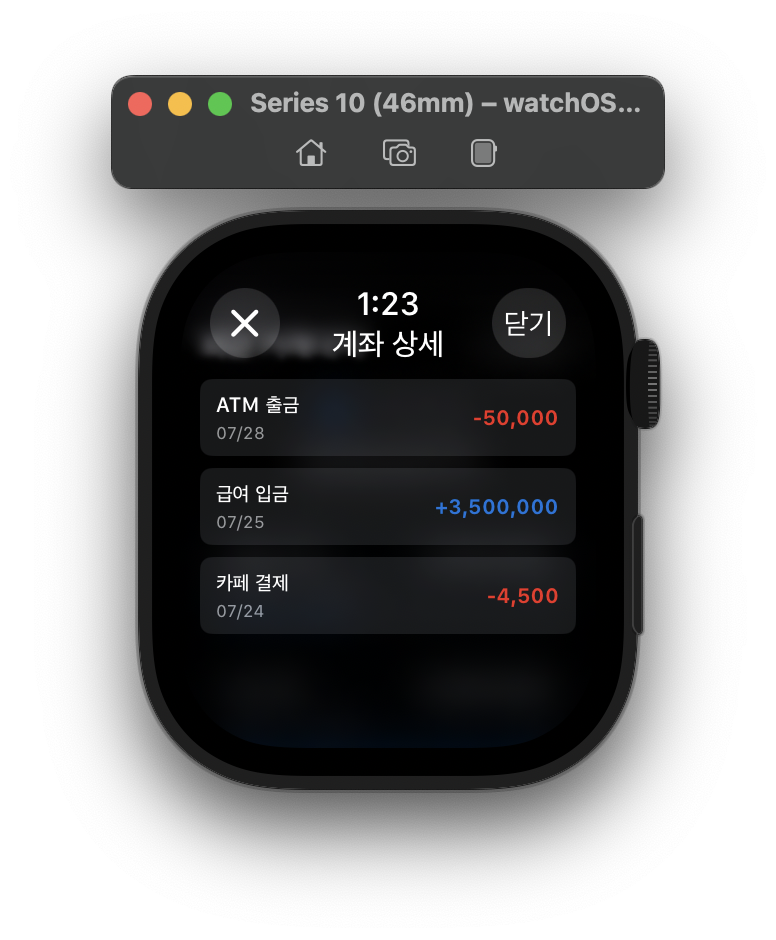
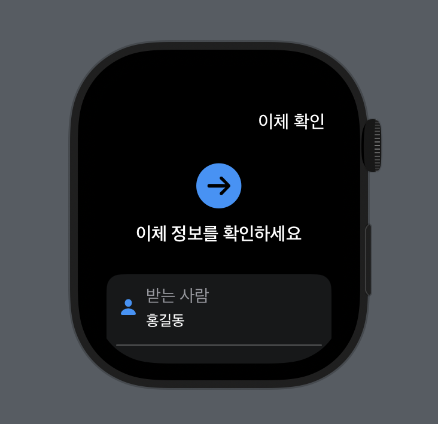

# 신한은행 ICT 인턴십 개인프로젝트

## 개요

Apple Watch용 신한은행 애플리케이션에서 음성 인식과 성문 인식 기술을 활용한 안전한 계좌이체 기능을 개발합니다. 사용자는 음성 명령만으로 간편하고 보안성 높은 이체 서비스를 이용할 수 있습니다.

## 주요 기술

### watchOS

개발 언어: Swift  
프레임워크:
- WatchKit (UI 개발)
- AVFoundation (음성 녹음)
- Speech (STT 변환)
- WatchConnectivity (iPhone과 통신)

### server

프레임워크: Flask  
주요 라이브러리:
- Flask-RESTful (API 개발)
- librosa (음성 신호 처리)
- scikit-learn (성문 인식 ML 모델)
- SQLAlchemy (데이터베이스 ORM)
- JWT (인증 토큰)

## 상세 비즈니스 로직

1. 사용자는 애플워치 내 신한은행 앱을 클릭한다.
2. 사용자는 해당 앱 내에서 본인의 계좌 현황을 조회할 수 있고, 이체 버튼을 누를 수 있다.
3. 이체 버튼을 클릭하면 워치 내 마이크를 통해 보내고자 하는 이체 대상과 그 금액을 말할 수 있다.
4. 해당 문장을 음성 파일로 저장하고, watchOS 내 내장된 기술을 활용해서 STT를 통해 텍스트로 변환한다.
5. AI 성문 인식 기술을 활용하여 음성 파일과 기존 등록된 사용자 음성 간의 일치도를 판별한다.
6. 일치도가 임계치 이상일 경우, 동일 사용자로 간주하여 이체 로직이 진행된다.
7. 이체 전 STT로 변환된 문장을 활용하 계좌 이체 대상과 금액을 추출하여 사용자에게 알린다.
8. 사용자가 확인 버튼을 누르게 된다면, 이체를 진행하여 그 결과가 화면에 반영된다.

## 주요 동작 이미지

  

  

  

  

  

  

  

  